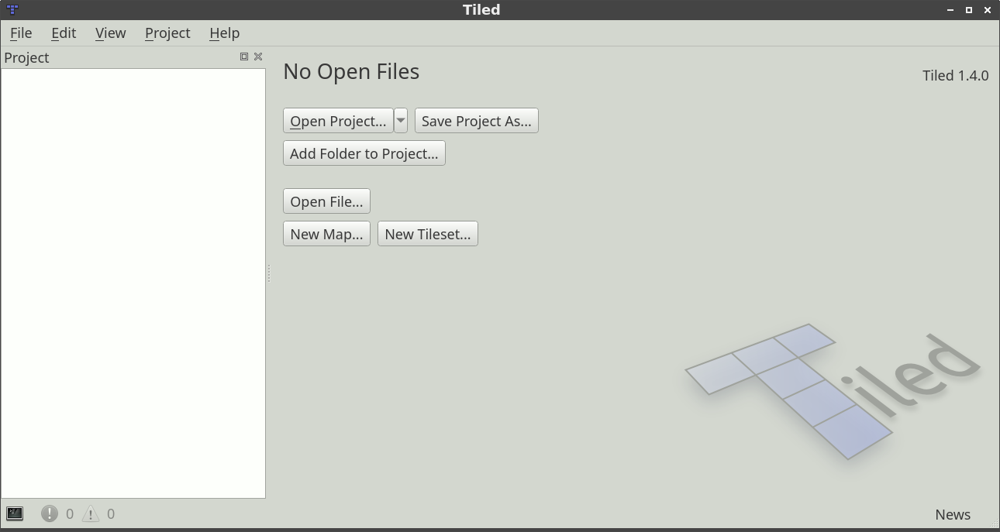
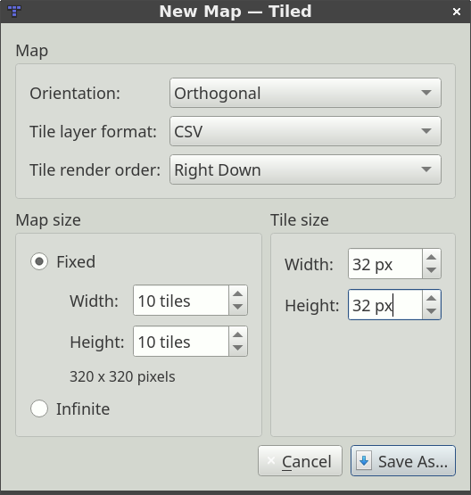
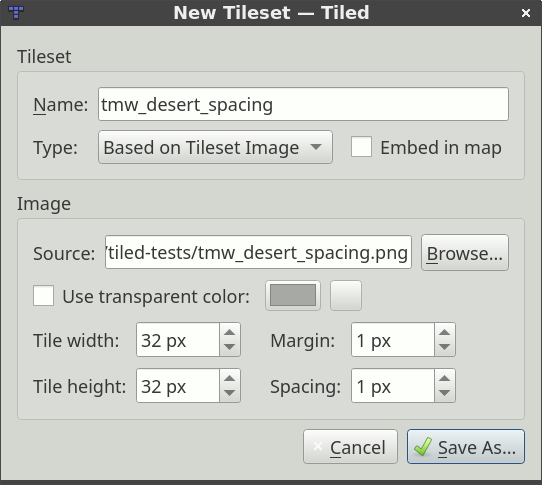
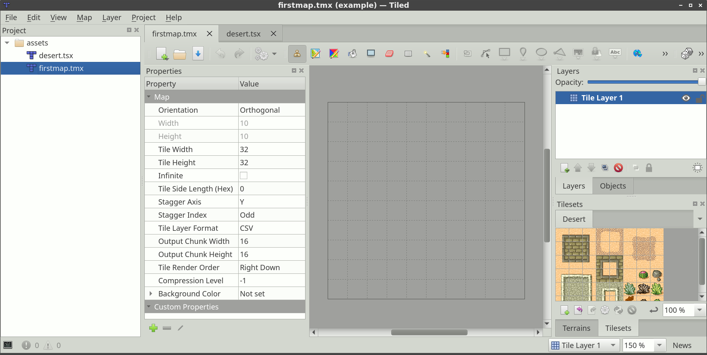

# Introduction

## About Tiled

**Tiled is a 2D level editor that helps you develop the content of your game. Its primary feature is to edit tile maps of various forms, but it also supports free image placement as well as powerful ways to annotate your level with extra information used by the game. Tiled focuses on general flexiblity while trying to stay intuitive.**

In terms of tile maps, it supports straight rectangular tile layers, but also projected isometric, staggered isometric and staggered hexagonal layers. A tileset can be either a single image containing many tiles, or it can be a collection of individual images. In order to support certain depth faking techniques, tiles and layers can be offset by a custom distance and their rendering order can be configured.

The primary tool for editing tile layers is a stamp brush that allows efficient painting and copying of tile areas. It also supports drawing lines and circles. In addition, there are several selection tools and a tool that does [automatic terrain transitions](using-the-terrain-tool.md). Finally, it can apply changes based on [pattern-matching](https://github.com/bjorn/tiled/wiki/Automapping) to automate parts of your work.

Tiled also supports object layers, which traditionally were only for annotating your map with information but more recently they can also be used to place images. You can add rectangle, ellipse, polygon, polyline and tile objects. Object placement is not limited to the tile grid and objects can also be scaled or rotated. Object layers offer a lot of flexibility to add almost any information to your level that your game needs.

Other things worth mentioning are the support for adding custom map or tileset formats through plugins, the tile stamp memory, tile animation support and the tile collision editor.

## Getting Started

### Creating a New Map

When launching Tiled for the first time, we are greeted with the following default window layout:

  

There is a large gray area in the middle because no map is open yet. The first thing we'll do is to start a new map with _File -> New..._ (`Ctrl+N`). The following dialog will pop up:

  

Here, we choose the initial map size, tile size, orientation, tile layer format and tile render order (only supported for _Orthogonal_ maps). All of these things can be changed later as needed, so it's not important to get it all right the first time.

After pressing _OK_, we'll see the tile grid and an initial tile layer will be added to the map. However, before we can start using any tiles we need to add a tileset. Choose _Map -> New Tileset..._ to open the New Tileset dialog:

  

Click the _Browse..._ button and select the `tmw_desert_spacing.png` tileset from the examples shipping with Tiled (or use one of your own if you wish). This example tileset uses a tile size of 32x32. It also has a one pixel _margin_ around the tiles and a one pixel _spacing_ in between the tiles (this is pretty rare actually, usually you should leave these values on 0).

After pressing _OK_, Tiled should look as follows:

  

We're ready to select some tiles and [start painting](editing-tile-layers.md)!
But first, let's have a quick look at the [various layer types](layers.md)
supported by Tiled.

*Most of the manual still needs to be written. Fortunately, there is a very nice [Tiled Map Editor Tutorial Series](http://www.gamefromscratch.com/post/2015/10/14/Tiled-Map-Editor-Tutorial-Series.aspx) on GamesFromScratch.com. In addition, the support for Tiled in various [engines and frameworks](../reference/support-for-tmx-maps.md) often comes with some usage information.*
